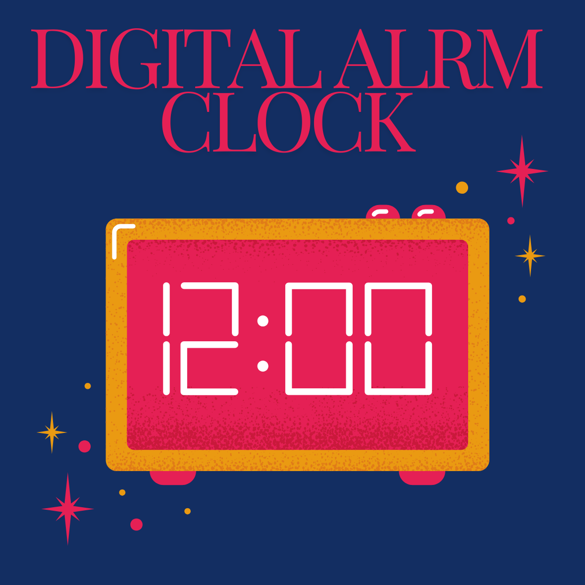

# Digital Alarm Clock in Verilog



## Description

This project is a Verilog implementation of a digital alarm clock. It includes multiple modules working together to provide time display, alarm functionality, and time setting capabilities. The clock is designed to show current time on a basic LCD display, sound an alarm when the set time is reached, and allow the user to set both the current time and alarm time using specific buttons.

## Modules

The project is structured into six main modules:

1. **Timer Generator**: Manages the timing signals and generates clock pulses.
2. **Alarm Controller**: Handles the alarm settings and triggers the alarm sound.
3. **Key Register**: Registers and processes input from the key button.
4. **Counter**: Counts time and manages the display of hours and minutes.
5. **Alarm Register**: Stores and manages the alarm time.
6. **Display Driver**: Controls the LCD display to show time and alarm settings.

## Inputs and Outputs

### Inputs
- **clk**: Clock signal.
- **reset**: Resets the clock and alarm settings.
- **stopwatch**: Activates stopwatch mode.
- **alarm button**: Sets or toggles the alarm time.
- **time button**: Sets or toggles the current time.
- **key**: Used to input time values.

### Outputs
- **sound**: Buzzer sound output when the alarm time is reached.
- **LCD Display**:
  - 1st LCD segment: Most Significant Hour (MS_Hour)
  - 2nd LCD segment: Least Significant Hour (LS_Hour)
  - 3rd LCD segment: Most Significant Minute (MS_Minute)
  - 4th LCD segment: Least Significant Minute (LS_Minute)

## Working

### Overview
The digital alarm clock performs several functions:
- **Displaying Current Time**: Shows the current time on the LCD display.
- **Alarm Functionality**: Activates a buzzer sound when the current time matches the alarm time.
- **Time and Alarm Setting**: Allows users to set the current time and alarm time.

### How to Use
1. **Display Time**: The current time is continuously displayed on the LCD.
2. **Set Time**:
   - Press the `time button`.
   - Use the `key` to input the desired time value.
3. **Set Alarm**:
   - Press the `alarm button`.
   - Use the `key` to input the desired alarm time.
4. **Activate Stopwatch**: Press the `stopwatch` button to start the stopwatch mode.

## Installation and Simulation

1. **Clone the Repository**:
    ```bash
    git clone https://github.com/username/digital-alarm-clock.git
    ```
2. **Navigate to the Project Directory**:
    ```bash
    cd digital-alarm-clock
    ```
3. **Compile and Simulate**:
    - Use a Verilog simulator like ModelSim or XSIM to compile and simulate the design.

## Contributing

Contributions are welcome! To contribute to this project:

1. **Fork the repository**.
2. **Create a new branch**:
    ```bash
    git checkout -b feature/your-feature-name
    ```
3. **Make your changes**.
4. **Commit your changes**:
    ```bash
    git commit -am 'Add new feature'
    ```
5. **Push to the branch**:
    ```bash
    git push origin feature/your-feature-name
    ```
6. **Create a Pull Request**.

## License

This project is licensed under the MIT License - see the [LICENSE](LICENSE) file for details.

## Contact

For questions or feedback, please contact:

- **Email**: pramothGIT@gmail.com
- **GitHub**: [PRAMOTHs-Repository](https://github.com/PRAMOTHs-Repository)
